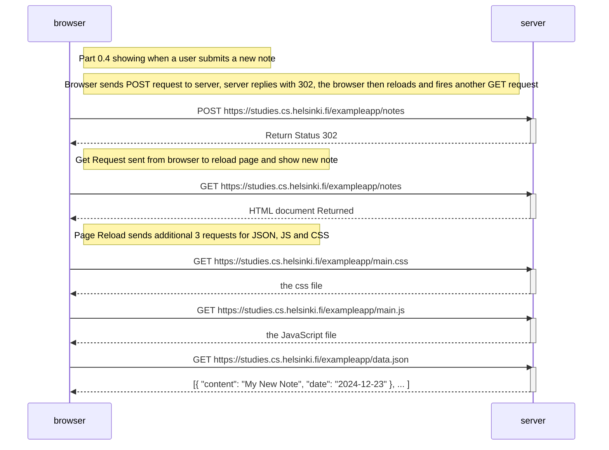

```mermaid
    sequenceDiagram
        participant browser
        participant server

        Note right of browser: Part 0.4 showing when a user submits a new note

        Note right of browser: Browser sends POST request to server, server replies with 302, the browser then reloads and fires another GET request
        browser->>server: POST https://studies.cs.helsinki.fi/exampleapp/notes
        activate server
        server-->>browser: Return Status 302
        deactivate server

        Note right of browser: Get Request sent from browser to reload page and show new note
        browser->>server: GET https://studies.cs.helsinki.fi/exampleapp/notes
        activate server
        server-->>browser: HTML document Returned
        deactivate server

        Note right of browser: Page Reload sends additional 3 requests for JSON, JS and CSS
        browser->>server: GET https://studies.cs.helsinki.fi/exampleapp/main.css
        activate server
        server-->>browser: the css file
        deactivate server

        browser->>server: GET https://studies.cs.helsinki.fi/exampleapp/main.js
        activate server
        server-->>browser: the JavaScript file
        deactivate server

        browser->>server: GET https://studies.cs.helsinki.fi/exampleapp/data.json
        activate server
        server-->>browser: [{ "content": "My New Note", "date": "2024-12-23" }, ... ]
        deactivate server
```
