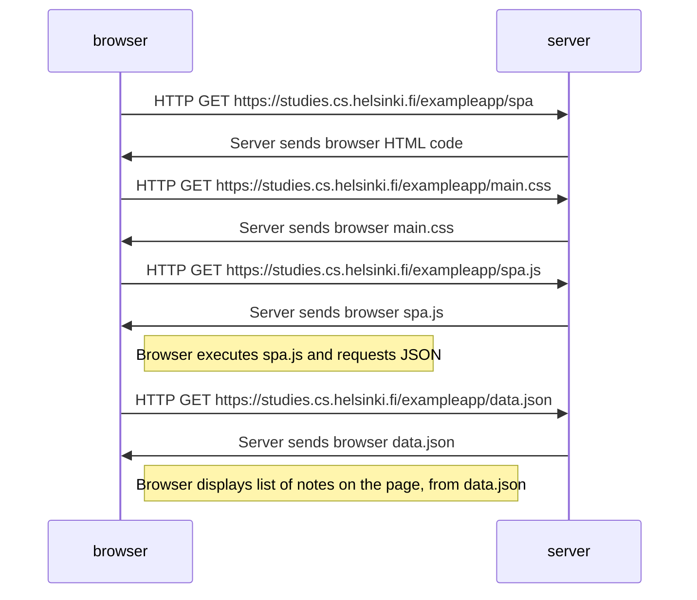

```mermaid
sequenceDiagram
        participant browser
        participant server

        browser->>server: HTTP GET https://studies.cs.helsinki.fi/exampleapp/spa
        server->>browser: Server sends browser HTML code
        browser->>server: HTTP GET https://studies.cs.helsinki.fi/exampleapp/main.css
        server->>browser: Server sends browser main.css
        browser->>server: HTTP GET https://studies.cs.helsinki.fi/exampleapp/spa.js
        server->>browser: Server sends browser spa.js
        
        Note right of browser: Browser executes spa.js and requests JSON
        
        browser->>server: HTTP GET https://studies.cs.helsinki.fi/exampleapp/data.json
        server->>browser: Server sends browser data.json
        
        Note right of browser: Browser displays list of notes on the page, from data.json

```
        
